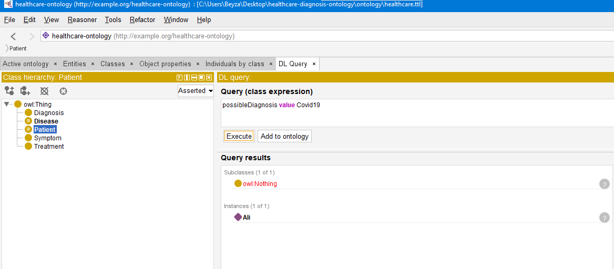

#  Healthcare Diagnosis Ontology

##  Overview
This project implements a simple healthcare diagnosis system using OWL ontology.  
The goal is to model relationships between patients, symptoms, and diseases, and to automatically infer possible diagnoses using logical reasoning.

---

##  Scope and Objectives

### Scope
The ontology models a simplified healthcare domain including:
- Patients
- Diseases
- Symptoms
- Treatments

### Objectives
- Represent medical knowledge in a structured semantic format
- Enable inference of possible diseases based on reported symptoms
- Demonstrate reasoning capabilities using OWL and Protégé

---

##  Core Concepts and Relationships

### Classes
- Patient
- Disease
- Symptom
- Treatment
- Diagnosis

### Object Properties
- hasSymptom (Disease → Symptom)  
- reportsSymptom (Patient → Symptom)  
- hasTreatment (Disease → Treatment)  
- possibleDiagnosis (Patient → Disease)  

---

##  Inference Logic

A property chain axiom is defined:

reportsSymptom ∘ inverse(hasSymptom) ⊑ possibleDiagnosis

### Explanation
If:
- A patient reports a symptom  
- And a disease has that same symptom  

Then that disease is inferred as a possible diagnosis for that patient.

---

##  Example Scenario

### Defined Individuals

#### Symptoms:
- Fever  
- Cough  
- Headache  
- ShortnessOfBreath  

#### Diseases:
- Covid19  
- Influenza  
- Asthma  

#### Patient:
- Ali  

### Relationships

- Covid19 → hasSymptom → Fever, Cough, ShortnessOfBreath  
- Influenza → hasSymptom → Fever, Cough, Headache  
- Asthma → hasSymptom → ShortnessOfBreath, Cough  

- Ali → reportsSymptom → Fever, Cough  

---

##  DL Query Example

possibleDiagnosis value Covid19

###  Result:
Ali
##  Inference Result

### Additional Query

DL Query:
possibleDiagnosis value Influenza

Result:
Ali

##  Key Contribution

This project demonstrates how semantic reasoning can automatically infer medical diagnoses from patient symptoms without explicitly defining them.

### Interpretation:
The reasoner correctly infers that Ali may have Covid19, based on shared symptoms.

---

##  Tools Used
- Protégé (Ontology editor)
- HermiT Reasoner (Inference engine)

---

##  Project Structure

- ontology/healthcare.ttl → Main ontology file  
- docs/ → Documentation and design notes  
- queries/ → Example DL queries  
- validation/ → Testing and validation files  

---

##  Design Decisions

- Used OWL Object Properties to model relationships
- Applied property chain reasoning for diagnosis inference
- Chose a minimal but extensible domain model
- Focused on explainable inference instead of complex probabilistic models

---

##  Future Improvements

- Add more diseases and symptoms  
- Include severity levels for symptoms  
- Introduce patient profiles (age, gender, history)  
- Integrate probabilistic reasoning  

##  Files
- healthcare.ttl → main ontology file

##  Conclusion

This ontology demonstrates how semantic web technologies can be used to:
- Model healthcare knowledge  
- Perform logical reasoning  
- Automatically infer medical insights  

The system successfully derives possible diagnoses from symptoms, validating the correctness of the ontology design.